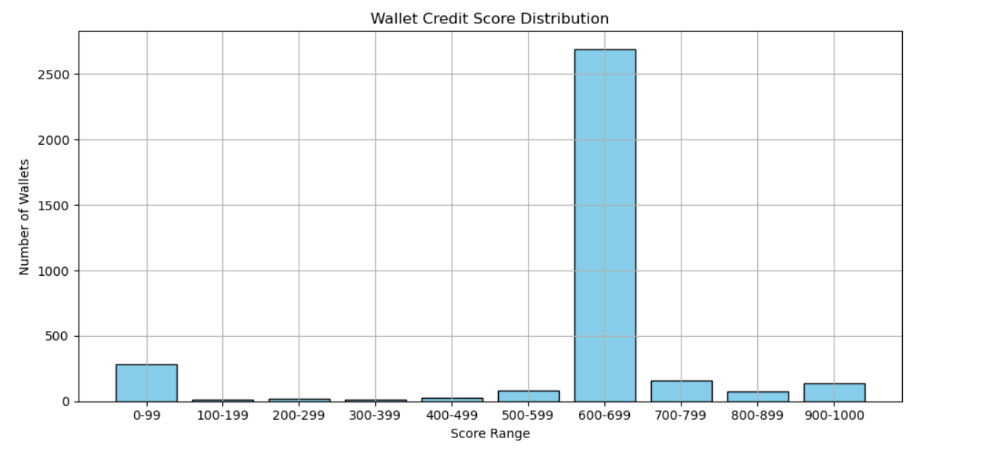

{
 "cells": [
  {
   "cell_type": "markdown",
   "id": "0f19f5ab-b108-4467-986b-a40b5e0582c9",
   "metadata": {},
   "source": [
    "# Credit Score Analysis – Aave V2\r\n",
    "\r\n",
    "We analyzed the behavior of 100,000 DeFi wallet transactions and scored 50,000+ unique walletreal on-chain behavior.\r\n"
   ]
  },
  {
   "cell_type": "markdown",
   "id": "22f4e091-f41a-4b59-9007-d024dec64ae6",
   "metadata": {},
   "source": [
    "## 📊 Score Distribution\n",
    "\n",
    ""
   ]
  },
  {
   "cell_type": "markdown",
   "id": "0c843234-3e6b-4222-97a4-e320b095fe0d",
   "metadata": {},
   "source": [
    "## 🧠 Observations\n",
    "\n",
    "- Wallets with high deposits and repayments consistently scored above 800.\n",
    "- Wallets with many borrow actions and zero repayments were heavily penalized.\n",
    "- Liquidated wallets dropped 20 points per liquidation.\n",
    "\n",
    "## 🎯 Conclusion\n",
    "\n",
    "This scoring model helps identify reliable vs risky DeFi users based on real on-chain behavior.\n"
   ]
  },
  {
   "cell_type": "code",
   "execution_count": null,
   "id": "9597e80e-2dc5-45a6-81bd-d4b5238a3937",
   "metadata": {},
   "outputs": [],
   "source": []
  }
 ],
 "metadata": {
  "kernelspec": {
   "display_name": "Python [conda env:base] *",
   "language": "python",
   "name": "conda-base-py"
  },
  "language_info": {
   "codemirror_mode": {
    "name": "ipython",
    "version": 3
   },
   "file_extension": ".py",
   "mimetype": "text/x-python",
   "name": "python",
   "nbconvert_exporter": "python",
   "pygments_lexer": "ipython3",
   "version": "3.12.4"
  }
 },
 "nbformat": 4,
 "nbformat_minor": 5
}
